# Preflop Advisor based on Monker

A desktop tool that reads frequencies and EVs out of PLO and PLO8 Monker preflop
simulations, for a hand you choose or for one it deals you. Point it at your exported
preflop trees and it gives you a fast action-and-EV profile of any hand, at any stack
depth, ante structure and table size — without loading the full tree in MonkerSolver and
clicking through long action sequences.

The interface is a PySide6 (Qt 6) application with seven screens: **Advisor**, **Trainer**,
**Explorer**, **Review Hands**, **Analytics**, **Simulations** and **Configuration**.

## Table of contents

- [Description](#description)
- [Screenshots](#screenshots)
- [Features](#features)
- [Installation](#installation)
- [Importing your simulations](#importing-your-simulations)
- [Configuration](#configuration)
- [Range files and configuration](#range-files-and-configuration)
- [Usage](#usage)
- [The interface](#the-interface)
- [Development](#development)
- [License](#license)
- [Contact](#contact)

## Description

Preflop Advisor is a Python tool designed to read frequencies and EVs from PLO and PLO8
Monker preflop simulations for a given hand. The idea is to export all of your Monker
preflop trees and get a very fast action and EV profile of a given hand for different stack
sizes, ante structures and number of players, without loading the full preflop tree in
MonkerSolver and clicking through long action sequences.

- **Games.** PLO and PLO8 are the primary targets. PLO 5-Card is supported too (it is
  probably not relevant for most players, since MonkerSolver's 5-card solver is not
  publicly available). No-Limit Hold'em is generally supported, but the hand-based view
  makes little sense for NL and it is not functional out of the box.
- **Solver versions.** The tool was written for MonkerSolver version 1. MonkerSolver
  version 2 exports hands in a slightly different order and needs a one-off preprocessing
  pass (see [Importing your simulations](#importing-your-simulations)). A MonkerSolver
  save (`.mkr`) can also be read directly, with no export at all.
- **Preflop ranges are not shipped.** The repository carries only a 100bb heads-up
  demonstration tree (`ranges/HU-100bb-with-limp`) plus a set of clearly fictional trees
  used by the tests. You have to set up and run your own preflop simulations, or buy them.

## Screenshots

Every screenshot below is taken from the heads-up 100bb tree bundled in `ranges/`, so every
number on them can be reproduced from a fresh clone.

### Advisor — the whole table at once

Position **X** puts every seat in one grid: what the hand opens with, and what it does
against each opponent. The frequency is large, the EV sits underneath, and an action's
colour is the same wherever it appears.

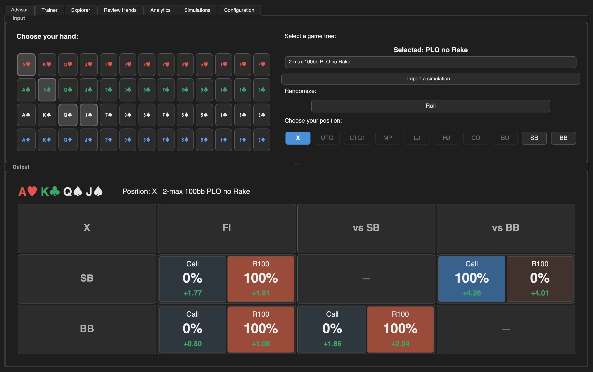

### Advisor — one seat in detail

Picking a seat replaces the grid with that seat's lines — squeezes, 4bets, and what it
faces after each.

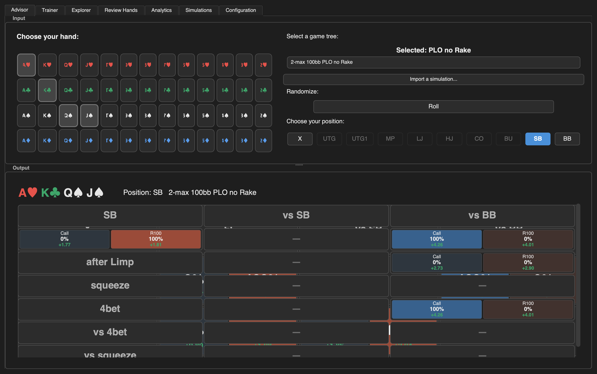

### Trainer — a question

The situation is drawn as a table: who is seated, what they did, what it left them, and
what is in the middle. The pot and the stacks are computed from the sizings the tree
declares; a hand whose line of play went through a sizing that cannot be read is drawn
without them rather than with invented ones.

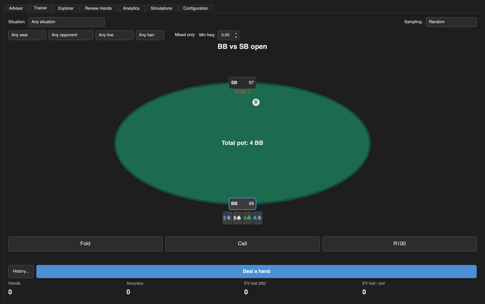

### Trainer — the answer

Answering reveals the solver's whole strategy for that node and what the chosen action
cost against its best one. The verdict is EV-based, never frequency-based: taking a line
the solver plays 3% of the time is not a mistake if it breaks even, and taking one it
plays 40% of the time is one if it does not.

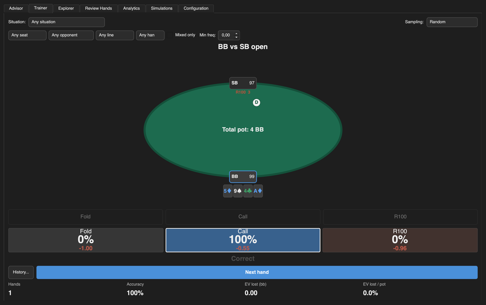

### Explorer — walk the tree, one decision at a time

The catalogue names families of spots; the Explorer reaches the rest — squeezes, 4bets,
blind-versus-blind lines, limps — by expanding the simulation's own tree lazily.

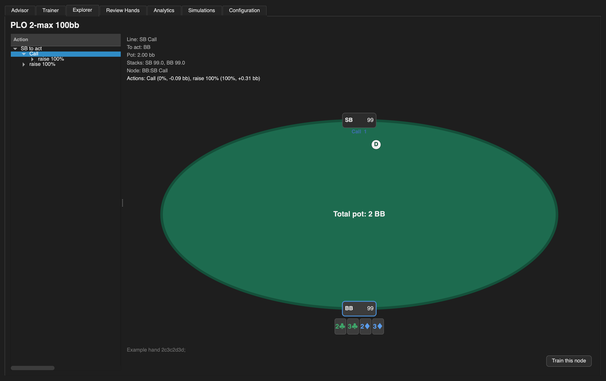

### Review Hands — real hands against the solver

Load a hand-review document (as fpdb-3's Replayer and Hand Viewer write it) and every
decision is matched against the simulation whose assumptions fit the table it was played
on, ranked worst first.

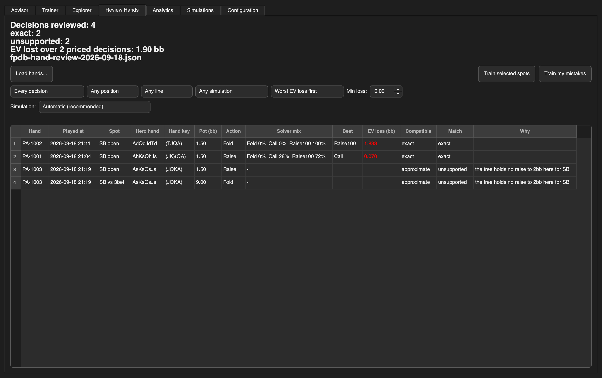

### Analytics — what a simulation is doing

A bounded survey of the selected tree: its seats, its line families, its sizings, how
mixed it is.

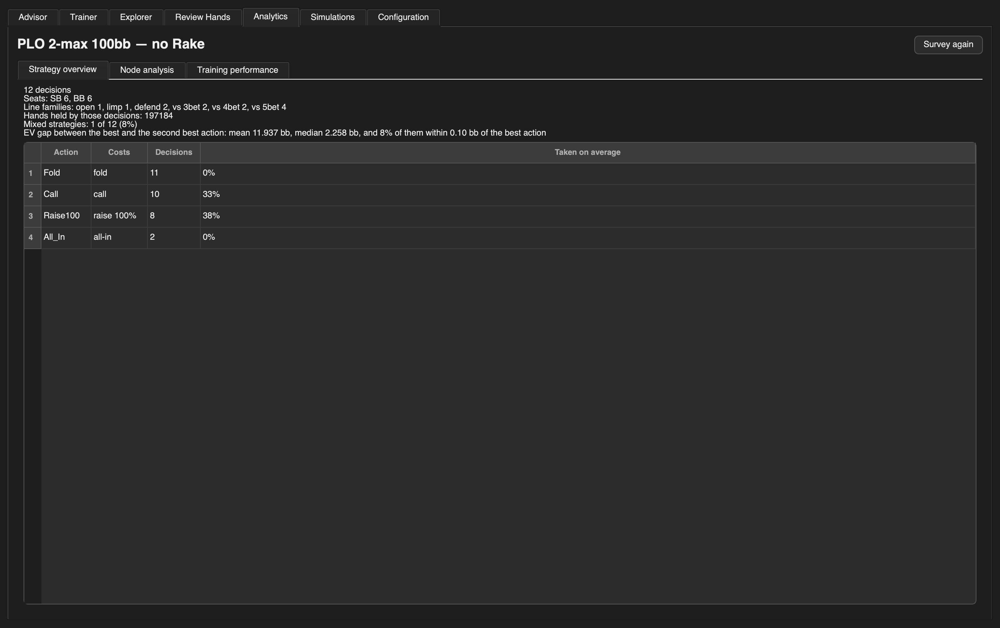

Which of its decisions are worth drilling, ranked by the closest, the most mixed, or the
most EV lost.

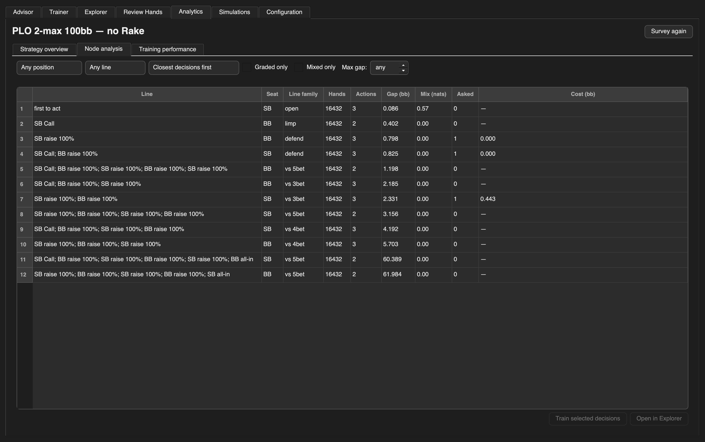

### Simulations — what each simulation is

Which strategy is *comparable* to a real hand is decided by metadata a range folder does
not carry: the rake the room charges, whether the session was cash or a tournament, the
room and stake names you think in. Facts read from the simulation are shown and not edited
here; everything editable is a declaration about your own game.

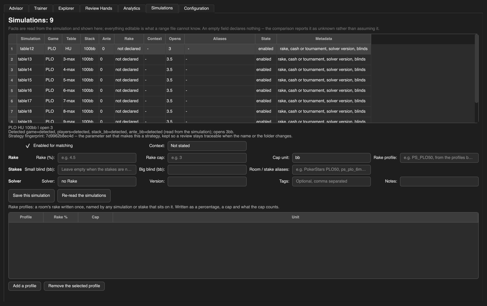

### Configuration — edit your own layer

Everything the application writes goes to your own override file, never to the shipped
`config.ini`, so its comments and sample trees survive.

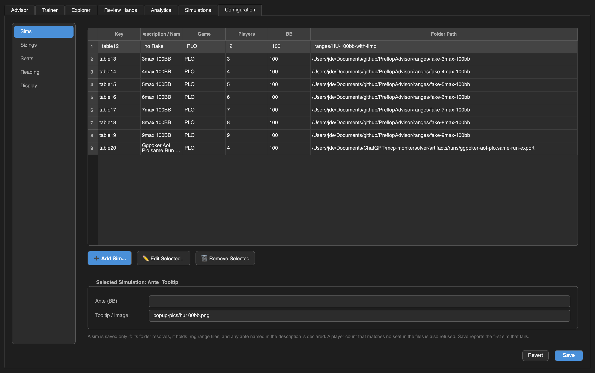

### Importing a simulation

The folder is inspected first, and only what it cannot say — stack depth, ante,
unrecognised action codes — is asked for.

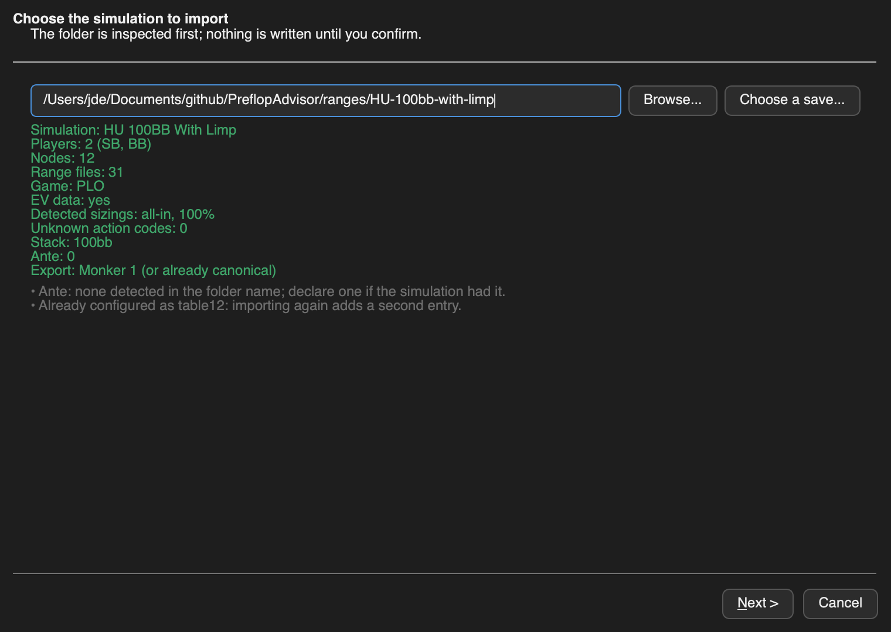

## Features

- **Concise PLO hand profile** for the most common preflop actions, for all your Monker
  preflop trees.
- **Multiple strategy trees** — as many as you configure, each with its own stack size,
  game, ante and rake note.
- **Frequencies and EVs side by side**, to make it easier to evaluate hand strength against
  opponents who do not play GTO preflop strategy. EVs are shown relative to folding, and
  in big blinds rather than Monker's milli-small-blinds.
- **Tooltips** for a quick overview of the general frequencies and strategies of a tree.
- **Advisor grid** — a whole-table overview, or one seat in detail with its squeeze, 4bet,
  vs-4bet and vs-squeeze spots.
- **Trainer** that deals hands from the selected tree and grades your answer in EV rather
  than in frequency, with a running tally and a persistent history.
- **Explorer** that walks the simulation's actual tree, one decision at a time, and offers
  to drill exactly the node on screen.
- **Review Hands** that compares real hands played in fpdb-3 against the solver, shows what
  each decision cost, and turns the worst of them into a training session.
- **Analytics dashboard** — a bounded survey of the strategy, a ranking of the decisions
  worth studying, and a reading of your training record.
- **Simulation catalogue** — per-simulation rake, context (cash/tournament), room and stake
  aliases, tags and notes, with a structural *fingerprint* that keeps a review traceable
  when a folder is renamed or moved.
- **Training history** in SQLite, keyed by the node's line of play, so it survives a
  re-export, a move of the range folder, or a change of solver.
- **Difficulty-aware sampling** — choose the next hand at random, or weight it towards the
  closest, the most mixed, the most EV-lost or the least-trained decisions.
- **Import wizard** for a Monker range folder, a folder of CSV strategy tables, or a
  MonkerSolver `.mkr` save read directly.
- **Configuration tab** that edits your own layer of the configuration and never touches
  the shipped preset.
- **Command line** — open straight on a hand-review document with `--review`, or trace
  every range lookup with `--verbose`.
- **Cross-platform build** — a standalone executable (`.app` on macOS, `.exe` on Windows,
  a binary on Linux) via PyInstaller.

## Installation

### Prerequisites

Python **3.10 or newer**. On Windows, make sure to select "Add Python to PATH" during
installation. [`uv`](https://docs.astral.sh/uv/) is used to manage the environment.

### Installation steps

1. **Download the repository.** Clone it, or open the
   [PreflopAdvisor GitHub page](https://github.com/ksoeze/PreflopAdvisor), click the green
   **Code** button and select **Download ZIP**, then extract it.

2. **Open a terminal** in the project directory.

3. **Install the dependencies and run with `uv`:**

   ```sh
   # Install all dependencies and set up the environment
   uv sync

   # Run the application
   uv run preflop_advisor

   # Or run the tests
   uv run --extra test pytest

   # Build a standalone executable (.app on macOS, .exe on Windows, binary on Linux)
   uv run --extra build python scripts/build.py
   ```

4. **Import your Monker trees** — see the next section.

5. **Configure the tool** — most of it is done in the application, in the
   [Configuration](#configuration) tab.

### Font sizes on high-resolution monitors

- **Card selector:** in `card_selector.py`, update `BUTTON_FONT`.
- **Tree selector:** in the Configuration tab (**Display**) or `config.ini` under
  `[TreeSelector]`, update `FontSize`.
- **Position selector:** in the Configuration tab (**Seats**) or `config.ini` under
  `[PositionSelector]`, update `FontSize`.
- **Output grid:** font sizes scale with the cell size; colours live in
  `preflop_advisor/theme.py`.

## Importing your simulations

There are three ways to bring a simulation in, and the in-app **Import a simulation…**
button drives all of them.

### Exporting from MonkerSolver

For every tree:

1. Open the tree in MonkerSolver.
2. Right-click in the range window → **Export preflop for MonkerViewer**.
3. The exported ranges land in the MonkerSolver folder under `ranges/`. Move the folder
   somewhere sensible, and give it a descriptive name if you plan to export many trees.
4. For MonkerSolver 2 only, re-sort the exported hands in place:

   ```sh
   python -c "from preflop_advisor.hand_convert_helper import replace_all_monker_2_files; \
              replace_all_monker_2_files('ranges/my-tree')"
   ```

   This can take a few minutes.

### Reading a MonkerSolver save directly

Skip the export entirely: a MonkerSolver save (`.mkr`) can be imported as-is. In the import
wizard, choose **Choose a save…** and pick the file; the wizard reads the game, seats,
depth and ante from the save itself. Saves written by MonkerSolver 2.1.9 and 2.3.10-beta,
for storage or for further calculation, are read; anything else is refused with the reason,
and the export above still works for it. The format and its verification are documented in
[`docs/native-import.md`](docs/native-import.md).

### CSV strategy tables

A folder of `*.csv` strategy tables is read as a simulation too. The import wizard detects
the source kind from what the folder holds and asks for whatever the tables do not state.

### The import wizard

The wizard holds to one rule: a value is either **detected** from the files or **declared**
by you, never invented. An assumed number that looks detected is worse than a blank the
wizard asks about. Confirmed answers are written to your own configuration layer — never
the shipped preset — so an import survives a restart.

## Configuration

Most of the configuration is done in the application, in the **Configuration** tab (next to
Advisor, Trainer and the rest): sims, sizings, seats, reading and display settings. Changes
are saved to your own override file under the application config location and never touch
the shipped `config.ini`, so its comments and sample trees survive.

If you prefer editing text, open `preflop_advisor/config.ini` in a text editor. The sections
below are the ones worth knowing.

### `[TreeInfos]`

Make an entry for each tree:

```ini
Table12=2,100,PLO,ranges/HU-100bb-with-limp,   no Rake
```

Every entry has to be there: `Name = Number of Players, Stacksize in BB, GAME, path to the
range folder, Rake setting`. The path may be absolute or relative to the project root. A
path that no longer exists still resolves if a folder of the same name sits under `ranges/`.

A MonkerSolver save is an entry whose path names the `.mkr` file itself:

```ini
Table13=4,5,PLO,ranges/ggpoker-aof-plo.mkr,AoF
Table13.kind=mkr
```

The player count, depth and game must be the save's own.

If the tree has an ante, say how big it is, in big blinds:

```ini
Table12.ante=0.125
```

The size is not in the export and nothing can guess it. A tree whose description mentions an
ante without declaring one is treated as having an ante of unknown size, and the trainer
draws its table with no pot and no stacks rather than with numbers that are all short by the
antes. Leave it out when there is none; a description saying so — `no ante` — is understood.

### `[TreeToolTips]`

Add tooltips for each tree, if desired. Ensure the number of tooltips matches the number of
trees. Tooltip overviews were generated programmatically with `scripts/frequency_report.py`;
read there if you want to produce your own. Otherwise generate a popup by hand or reuse one
of the shipped images under `preflop_advisor/popup-pics/`. Tooltips are optional — disable
them with `ToolTips=NO` in `[TreeSelector]`.

### `[TreeReader]`

This is the part worth understanding before editing `config.ini`: the action codes, the
`RaiseSizeList`, the seat names and the cache/database settings. It is covered in detail in
[Range files and configuration](#range-files-and-configuration).

## Range files and configuration

### Range file format

Each tree is a folder of `.rng` files. A file is a flat list of line pairs:

```
(3K)(4A)
0.826;2289.79
```

The first line is the hand in Monker's normalized notation (ranks grouped by suit, with
parentheses around cards sharing a suit); the second is `frequency;EV`. Frequencies at a
node sum to 1. EVs are in chips where the big blind is worth 2000, which is why folding the
big blind reads as `-2000`; the tool divides by `[Output] ChipsPerBB` to display big blinds.

### How a file name encodes a line of play

The file name is the sequence of actions taken, joined by dots, each action replaced by its
Monker code from `[TreeReader]`:

| File | Meaning |
| --- | --- |
| `0.rng` | SB folds |
| `1.rng` | SB limps |
| `40100.rng` | SB raises pot |
| `40100.1.rng` | SB raises pot, BB calls |
| `40100.40100.rng` | SB raises pot, BB 3bets |

### `RaiseSizeList`

Every entry of `RaiseSizeList` is the *name of a key defined in the same section*, and that
key holds the Monker code used in file names:

```ini
Raise75=40075
RaisePot=2
Raise100=40100
All_In=3
RaiseSizeList=Raise75, RaisePot, Raise100, All_In
```

When the tool needs a raise it tries these sizings *in the order listed* and keeps the first
one that actually exists in the tree, since not every tree is exported with the same sizings.
An entry that is not declared as a key is a configuration error and the tool says so rather
than guessing.

To add a sizing, find its code by looking at the file names in your range folder, add a
`Name=code` line, and list `Name` in `RaiseSizeList`. The Configuration tab's **Sizings**
panel does this for you: it lists the action codes your sims actually contain and flags the
ones the tool cannot yet decode, so you only declare the sizings your trees use.

#### What a sizing costs, and when that cannot be told

The advisor never needed to know: a range file is found by the *names* of the actions, so
what they cost was never asked. The trainer's table cannot be drawn without it — a pot of
"1.5 BB" and a stack of "100" are the same two numbers whatever has happened.

The meaning is in the code, not the name. Names are labels you chose, so `HouseSize=40062`
still means 62 percent. Two families can be read:

- the special codes every export uses: `0` fold, `1` call, `2` pot, `3` all-in;
- `40000 + N`, a raise of N percent, matching the relative sizings Monker shows as `75%`.

That second one is an inference from the shape of the family — 40060, 40070, 40075, 40100
against names saying 60, 70, 75 and 100 — not a published fact. Monker publishes no table of
codes.

Everything else is unknown and says so. Monker has fixed sizings in small blinds as well
(`12sb`), so a code such as `15` may be one, or an index, or a house convention.

An unreadable sizing costs you the hands that go through it, not the tree. It is the line of
play that is priced, so a question whose line never used that sizing is drawn with its pot
and stacks as usual, and only the ones that did are drawn without them. You can declare what
yours mean, and get those back:

```ini
# 3xOpen raises to three big blinds
3xOpen=15
3xOpen.blinds=3
# HouseSize raises 45 percent of the pot
HouseSize=17
HouseSize.pot=0.45
```

Comments go on their own line, as everywhere else in this file: nothing strips a comment
written after a value, so the number would be read with the sentence still attached to it and
thrown out as unreadable.

### Seats, and what their names do

`Positions` lists the seats shortest stack first. It is trimmed to the tree's player count
and reversed into acting order, which is the order the reader fills folds against.

Trimming one list cannot name every table: six-handed the earliest seat is UTG, and
seven-handed there is a hijack between it and the cutoff, so cutting a seven-name list down
to six drops UTG and keeps HJ. Sizes that need their own names have their own entry:

```ini
Positions=BB,SB,BU,CO,MP,UTG
Positions7=BB,SB,BU,CO,HJ,MP,UTG
Positions8=BB,SB,BU,CO,HJ,LJ,MP,UTG
Positions9=BB,SB,BU,CO,HJ,LJ,MP,UTG1,UTG
```

Which reads, in acting order:

| seats | order |
| --- | --- |
| 6 | UTG MP CO BU SB BB |
| 7 | UTG MP HJ CO BU SB BB |
| 8 | UTG MP LJ HJ CO BU SB BB |
| 9 | UTG UTG1 MP LJ HJ CO BU SB BB |

**The names are labels.** A file name is built from the action codes and from where a seat
sits in the list, never from what it is called, so renaming `HJ` to `LJ` changes the column
header and nothing else. If your solver labels the middle seats differently, edit these lines
to match it; what has to stay right is how many seats there are and the order they act in.
Every seat you name also needs a button, in `[PositionSelector] PositionList`.

### Reading through a database instead of the range files

Off by default. `[TreeReader] UseDatabase=yes` makes the tool read hands from a `preflop.db`
built next to the ranges rather than scanning the `.rng` files:

```ini
UseDatabase=yes
```

The database is built the first time a tree is read, behind a progress dialog, and rebuilt
whenever the range files change. Each file's name, size and modification time are recorded in
it and checked every time the tree is read, so re-exporting a tree from the solver is picked
up without restarting the advisor — the check is one stat per range file, 0.2 ms over the
tree above. The range files are never deleted: they are what a rebuild reads.

What it buys, measured on the heads-up tree shipped in `ranges/` (31 files, 15.4 MB):

| | range files | database |
| --- | --- | --- |
| first grid | 23.2 ms | 0.1 ms |
| further grids | 0.04 ms | 0.07 ms |
| memory used | 25.4 MB | 8.6 MB |
| disk used | 15.4 MB | 15.4 + 24.8 MB |

Once a file is in the cache the in-memory path is marginally faster, so on a tree this size
`CacheSize` is the better answer. The database earns its place on a large PLO5 export, where
files run to hundreds of megabytes and holding them in RAM is what `CacheSize` warns about.
Building one takes about a second for the tree above.

If the database cannot be built or read — an unwritable folder, a corrupt file — the tool
logs it and reads the range files instead.

## Usage

```sh
uv run preflop_advisor
# or
python standalone.py
```

To open straight on a hand review — the JSON document fpdb-3's Replayer and Hand Viewer save
under `/Solver review/` — pass it with `--review`:

```sh
uv run preflop_advisor --review fpdb-hand-review-1234.json
```

The window opens on **Review Hands** with that document loaded, exactly as **Load a hand
review** would; a file that cannot be read is reported there rather than stopping the app.

Add `--verbose` to log every range lookup (very chatty — it fires once per displayed cell).

## The interface

The application is a single window with a tab per screen. The Advisor, Trainer, Explorer and
Analytics all read whichever tree the Advisor's selector is on, so switching trees switches
what you are looking at and drilled on.

### Advisor

The input sits in a band across the top — cards on the left, tree, randomizer and seats on
the right — with the results underneath, separated by a divider you can drag. Where you leave
it is remembered along with the window size, so the layout follows the screen it is used on.

The results are the wide part: a table of *N* seats is *N+2* columns, so nine-handed is
eleven, and a column cannot be narrower than 112 pixels without cutting the numbers in it.
That is why they get the full width rather than half of it. The window asks for 1400×1040 —
what a nine-handed overview needs — and takes the smaller of that and the usable screen, so a
1366×768 laptop opens to what it has.

**Band, left — Card selector.** A row per suit, a column per rank. Select the hand you want.
Clicking a selected card unselects it. Once the hand is full, clicking another card replaces
the oldest one rather than clearing the whole selection. The number of cards follows the
game: 2 for NL, 4 for PLO/PLO8, 5 for PLO5.

**Band, right — Tree selector.** Lists the available trees as configured in `[TreeInfos]`.
Tooltips provide additional information if configured. Selecting a different tree updates the
output for the currently selected hand.

**Band, right — Randomizer.** Rolls an action so you can test yourself on one decision at a
time without leaving the Advisor; a roll only changes which action is highlighted, so it
re-renders the existing results rather than re-reading the ranges.

**Band, right — Position selector.** The default position is **X**, an overview of all
positions. Selecting a specific position shows detailed information about that position's
strategies, including 4bet and squeeze spots. Which seats are offered follows the selected
tree's player count, named as `Positions` and its per-size overrides say.

**Below — Output grid.** The top line shows the hand, the position and general information
about the selected tree.

*General overview (position X).* The first column shows available positions; the second shows
the first in action. For positions other than SB it assumes only an open-raise is possible.
For example, UTG first-in for this hand shows:

- line 1, `Raise100` — meaning a pot open; it shows the description for the sizing given in
  `config.ini`;
- line 2, `0` — the frequency suggested by Monker; over 50% the item gets a lighter
  background for visibility;
- line 3, `-0.12` — the EV estimate by Monker in **big blinds** (changed from Monker's
  default milli-small-blinds).

In contrast to the Monker interface it shows *relative* EVs: when facing a 3-bet it shows the
EV compared to folding at this point, not the overall EV from the start.

Other columns show information versus positions. If the position in the top line comes before
ours, it shows us facing an open-raise (left item call, right item 3bet). Otherwise we open
and face a 3bet from the other position (left item call 3bet, right item 4bet). The small
blind has an option to open-limp; if your tree only has an open-or-fold strategy, the limp
cell simply shows `—` (no data) and it just shows the raise item. The SB-vs-BB entry shows
the action after we open-raise. For the action after we open-limp and the BB raises, see the
SB position view.

*Position overview.* The first result line is equal to the corresponding result line from the
default view. Then:

- **Squeeze** — the action for: column position opens, the player right next to him
  cold-calls, and it folds to us where we can call/squeeze. It is the *tightest* of the
  squeeze spots possible versus this opener. If there is no second overcall in the tree, the
  cell shows `—`.
- **4bet** — if the column position is before us, it assumes an open from the player before
  him, he 3bets, and we have the option to cold-4bet. Otherwise it shows the standard: we
  open and face a 3bet from the other position.
- **vs 4bet** — same idea. A position before us means we face a 4bet from the opener after we
  3bet him; otherwise we face a cold 4bet after we 3bet the player right before us.
- **vs squeeze** — we open, the player right next to us flats, and we then face the squeeze
  from the column position (the classic sandwich spot).

### Trainer

Deal a hand, answer, see what it cost.

- **Which situation.** The chooser offers the situations the selected tree's table size has:
  opening first in, defending an open, and facing the 3bet back. Left on *any situation* the
  whole catalogue is drilled. The big blind is never offered "first in" — everyone folding to
  it ends the hand — so what it gets is the small blind's limp.
- **Filters.** Narrow the pool by seat, opponent, line, hand, whether the node is mixed, and
  a minimum frequency.
- **Sampling.** How the next question is chosen: at random, or weighted towards the closest,
  the most mixed, the most EV-lost or the least-trained decisions (see *Difficulty-aware
  sampling* below).
- **The table.** Seats in acting order with you brought to the near side, what each one did
  and has left, the dealer button, your cards, and the pot. Every figure is computed from the
  sizings the tree declares, under the pot-limit rule: call first, then raise by no more than
  the pot that call makes. A hand whose line went through a sizing with no published meaning
  is drawn without a pot and without stacks, rather than with numbers that might be wrong;
  the hands that avoid that sizing keep theirs. Two things have to be readable for the table
  to carry numbers, and both can be declared when they are not: what each sizing costs (see
  `RaiseSizeList` above) and how big the ante is (`Table12.ante=0.125`, beside the tree in
  `[TreeInfos]`). An ante left out would understate the pot, every percentage raise, every
  stack and the tally's ratio, which is why an undeclared one hides them instead.
- **The verdict.** *Correct*, *Inaccuracy*, *Mistake* or *Blunder*, decided by how much EV
  the answer gave up against the best action in that node — not by how often the solver plays
  it. The whole strategy is revealed alongside, so a mixed node shows what it mixes.
- **The tally.** Hands, accuracy, EV lost in big blinds, and EV lost as a share of the pot. A
  hand whose pot could not be read still counts as an answer; only that last ratio abstains,
  and it averages over the hands it knows rather than counting the rest as noughts.

A tree holds the lines its solver was run for and no others, so a situation with nothing
behind it says so rather than pretending the tree is empty.

#### Difficulty-aware sampling

Random drilling is the right default and a poor method: it spends as much time on the
decisions that cannot be got wrong as on the ones that decide a session. The sampling modes
weigh each candidate by what the node's own strategy says about it:

| Mode | Weighs by |
| --- | --- |
| `random` | every candidate, equally (the default) |
| `frequency` | `1 + entropy`: what the solver straddles across several actions |
| `close` | `1 / (ε + gap)`: a small gap weighs heavily, a large one almost nothing |
| `mixed` | `spread + 1` when the solver really plays two ways or more |
| `weakness` | `1 + the EV this grouping has cost per hand`, from your history |
| `rare` | `1 / (1 + times this grouping has been answered)`: what has never come up, comes up next |

### Explorer

The catalogue names families of spots; the Explorer reaches the rest. The root is read when
the tab is opened, a node's children are read when it is expanded, and nothing else is
touched, so a tree of a hundred thousand files costs what the part of it on screen costs.

Selecting a node shows what the model knows about it — who acts, what the line has done, the
pot and the stacks when they can be worked out, the actions with what they cost, and an
example hand's frequencies — and offers **Train this node** to drill exactly that decision.
The spot handed to the trainer is the node's explicit line of play, so the history recorded
for it keys on the same node the analytics and the hand-history matching use.

### Review Hands

Load a hand-review document — the JSON that fpdb-3's Replayer and Hand Viewer write under
`/Solver review/` — and every decision in it is matched against the configured simulations.
Decisions are listed worst first; a row that could not be matched says why in its own column
rather than being left blank — *"the tree holds no raise to 5bb here for SB"* is the answer,
and it is the answer you came for.

Each decision comes out with a status:

| Status | Meaning |
| --- | --- |
| `exact` | The decision, and every sizing before it, is what the tree holds. |
| `sized` | The same decision, through a raise within the tolerance of a stored one. |
| `ambiguous` | Two or more stored actions are within tolerance of what was played. |
| `no node` | A simulation fits the hand, but holds no decision on this line. |
| `no simulation` | Nothing configured is this game, at this table size, this deep. |
| `ambiguous simulation` | Two simulations are equally compatible; the choice is yours. |
| `unsupported` | The hand cannot be read, and nothing is claimed about it. |

The EV of a decision is only ever read off a *matched* node, for the hand's own canonical
key, and only where the source reports EVs at all. An unmatched hand gets no frequencies, no
best action and no loss: *"no compatible simulation"* is an answer, and a fabricated one is
worse than none. **Train selected spots** drills one decision; **Train my mistakes** turns the
worst of them into one session.

### Analytics

Three sub-tabs, in the order a study session reads them:

- **Strategy overview** — a bounded, breadth-first survey of the tree: its seats, its line
  families, how many hands each decision holds, which actions it offers, how evenly it splits
  between them, and what the best action is worth over the second best. The walk is bounded
  on purpose and says whether it finished; coverage is reported as "of the N decisions
  surveyed", never as a census computed from a sample.
- **Node analysis** — which decisions are worth studying, ranked by the closest, the most
  mixed, the most EV lost or the least trained, and narrowed by seat and line family. A
  selected node opens in the Explorer, and any number of them start one training session.
- **Training performance** — the training record: what was answered, how accurately, and
  where the EV is still being lost. Solver frequency is never read as a score; the grade is
  the EV, and the frequencies are evidence about the spot.

### Simulations

Every other screen reads one simulation at a time and shows strategy; this one shows the
simulations themselves. Facts read from the simulation — variant, seats, depth, ante, the
sizes it opens for — are shown and not edited here. Everything editable is a *declaration*
about your own game: the rake, the context (cash or tournament), room and stake aliases,
tags and notes, stored beside the tree entry it describes.

An empty field declares nothing, so a simulation that says nothing about its rake is reported
as incomplete and its rake is compared as *unknown* — never as "no rake", which is a
different statement. The catalogue's identity for a strategy is its poker parameters, never
the room printed on it: the **fingerprint** column is that identity, and it is what makes a
review still traceable after somebody renames the simulation or moves it to another folder.
Rake profiles are written once in `[RakeProfiles]` and named by any simulation or stake that
sits on them.

### Configuration

Edits your own layer of the configuration, the only file the application writes. Every change
is staged in memory and committed with **Save**; a section's **Reset** drops that section's
keys from your file so the shipped preset takes over again. The panels are **Sims**,
**Sizings**, **Seats**, **Reading** and **Display**. Saving never touches the shipped
`config.ini`, which is why the preset keeps its comments and its sample trees.

## Development

```sh
uv sync --extra dev
uv run pytest                # 1370 tests, coverage gate at 90%
uv run pytest -m "not slow"  # skip the subprocess smoke test
uv run ruff check . && uv run ruff format --check .
uv run mypy                  # strict; the package and scripts are fully annotated
uv run preflop_advisor --verbose   # log every range lookup
```

The architecture keeps Qt at the edges. Everything that decides anything — the strategy
model, the matching, the grading, the survey, the history — lives in modules with no toolkit
imported, so it is tested without a window; the panels show questions and report answers.

Two design documents go deeper:

- [`docs/native-import.md`](docs/native-import.md) — what a `.mkr` save holds and how it is
  read, each reading checked against the solver's own export of the same simulation.
- [`docs/simulation-catalog.md`](docs/simulation-catalog.md) — how a real hand is matched to
  a simulation before any EV is compared.

## License

This project is licensed under the MIT License — see the [`LICENSE`](LICENSE) file for
details.

## Contact

The software is provided as-is with no plans for further features or major changes. For short
questions or minor changes, feel free to reach out.
