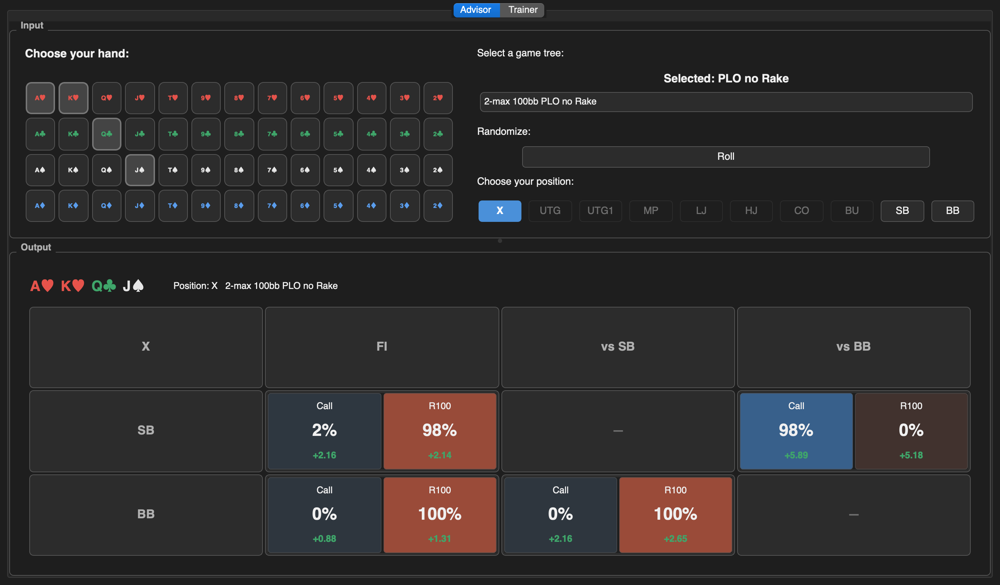
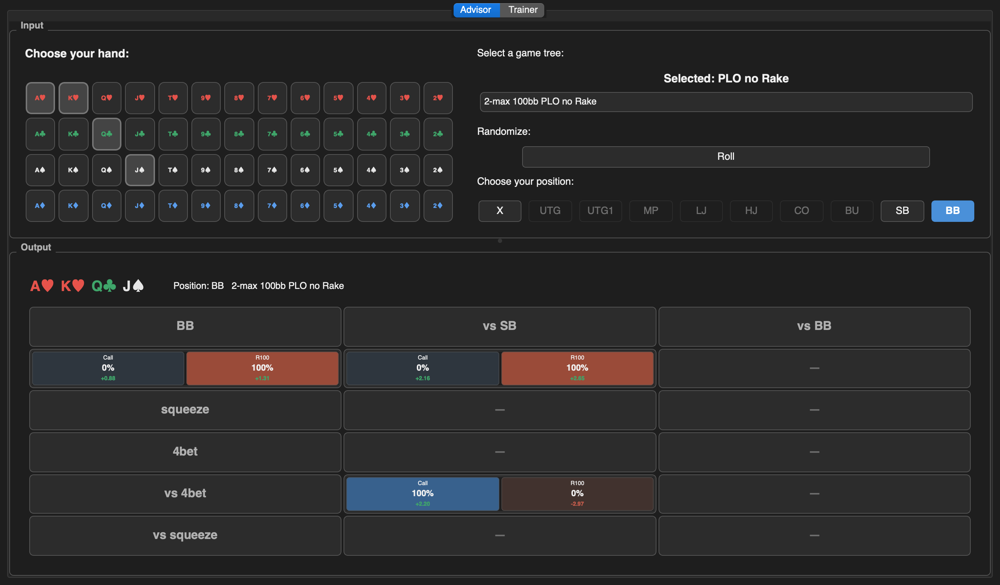
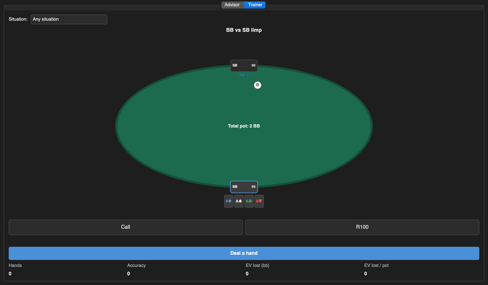
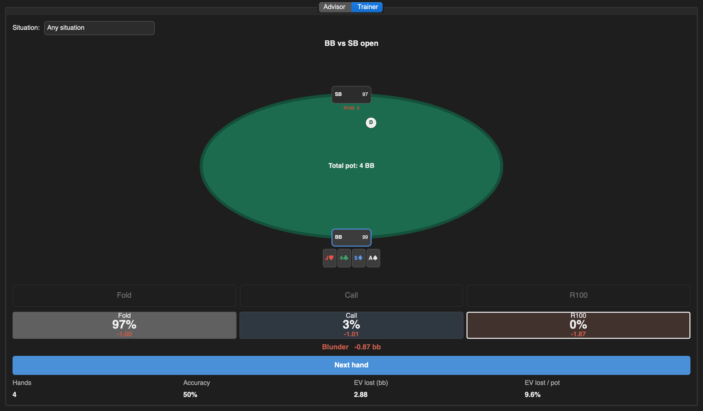

#+AUTHOR: [Johann]
#+DATE: [2024-07-04 Th]
#+OPTIONS: toc:t

* Preflop Advisor based on Monker

** Description
Preflop Advisor is a Python-based tool designed to read frequencies and EVs from PLO and PLO8 Monker preflop simulations for a given hand.
The idea is to export all of your Monker Preflop Trees and get a very fast action and EV profile of a given hand for different stack sizes, ante structures and number of players without loading the full preflop tree in MonkerSolver and clicking through long action sequences.
While the tool generally supports No Limit (NL), it is currently not functional out of the box for NL. (Hand based view makes also no sense for NL)
PLO 5-Card is generally also supported but probably not relevant for most players since Moker Solver 5-card is not available publicly.
This tool was written for Moker Solver version 1. Monker Solver version 2. exports hands slightly differently and therefore need some preprocessing.
See Usage for detailed Information. Preflopranges are not uploaded to this repository (only 100bb HU for demonstration) - you have to setup and run your preflop simulations on your own or buy it.

** Features
    - Concise PLO hand profile for most common preflop actions for all your Monker preflop trees.
    - Supports multiple (indefinite) preflop strategy trees
    - Displays frequencies and corresponding EVs to make it easier to evaluate handstrength against opponents who dont play GTO preflop strategy.
    - Tooltips in order to get a quick overview of the general frequencies and strategies for a given tree.
    - A trainer tab that deals hands from the selected tree and grades your answer against it, in EV rather than in frequency.

** Screenshots
Taken from the heads-up 100bb tree bundled in =ranges/=, so every number on them can be
reproduced from a fresh clone.

*** Advisor: the whole table at once
Position =X= puts every seat in one grid: what the hand opens with, and what it does
against each opponent. Frequency large, EV underneath, and the action's colour is the same
wherever it appears.

#+CAPTION: Advisor, overview of all seats

*** Advisor: one seat in detail
Picking a seat replaces the grid with that seat's lines -- squeezes, 4bets, and what it
faces after each.

#+CAPTION: Advisor, one seat

*** Trainer: a question
The situation is drawn as a table: who is seated, what they did, what it left them, and
what is in the middle. The pot and the stacks are computed from the sizings the tree
declares, and a hand whose line of play went through a sizing that cannot be read is drawn
without them rather than with invented ones.

#+CAPTION: Trainer, a hand to answer

*** Trainer: the answer
Answering reveals the solver's whole strategy for that node and what the chosen action
cost against its best one. The verdict is EV-based, never frequency-based: taking a line
the solver plays 3% of the time is not a mistake if it breaks even, and taking one it
plays 40% of the time is one if it does not.

#+CAPTION: Trainer, the verdict and the running tally

* Installation Guide
** Prerequisites
Before you begin, ensure you have Python 3.x installed on your computer. You can download it from [[https://www.python.org/downloads/][python.org]]. On Windows, make sure to select "Add Python to PATH" during installation.

** Installation Steps

1. Download the Repository:
   - Clone the repository or go to the [[https://github.com/ksoeze/PreflopAdvisor][PreflopAdvisor GitHub page]].
   - Click the green "Code" button and select "Download ZIP".
   - Extract the ZIP file to a folder on your computer.

2. Open a Terminal or Command Prompt:
   - On Windows: Press =Win + R=, type =cmd=, and press Enter.
   - On Linux: Open your preferred terminal emulator.

3. Navigate to the Project Directory:
   #+BEGIN_SRC sh
   cd path\to\PreflopAdvisor
   #+END_SRC

4. Install Dependencies & Run with uv:
   #+BEGIN_SRC sh
   # Install all dependencies and setup environment
   uv sync

   # Run the application
   uv run preflop_advisor

   # Or run tests
   uv run --extra test pytest

   # Build standalone executable (.app on macOS, .exe on Windows, binary on Linux)
   uv run --extra build python scripts/build.py
   #+END_SRC

5. Export your Monker Preflop trees:
   For every tree:
   - Open the Tree in Monker
   - Right Click in Range Window -> Export preflop for MonkerViewer
   - The exported Ranges are in the Monker Solver folder -> ranges
     move it to another location and/or give it a more descriptive name if you plan to export many trees.
   - For Monker Solver 2 only, re-sort the exported hands in place:
     #+BEGIN_SRC sh
     python -c "from preflop_advisor.hand_convert_helper import replace_all_monker_2_files; \
                replace_all_monker_2_files('ranges/my-tree')"
     #+END_SRC
     this can take a few minutes
6. Configure the Tool:
   - Open =preflop_advisor/config.ini= in a text editor (e.g., Notepad, nano, vim).
   - Edit the configuration sections as needed:
     - [TreeSelector]: Set NumTrees to the number of trees you are using.
     - [TreeInfos]: make an entry for each tree:
       + Table12=2,100,PLO,ranges/HU-100bb-with-limp,   no Rake
         this is an example for the 100bb HU tree - every entry has to be there.
         Name=Number of Players,Stacksize in BB, GAME, path to the range folder, Rake setting
         The path may be absolute or relative to the project root. A path that no longer
         exists still resolves if a folder of the same name sits under =ranges/=.
       + If the tree has an ante, say how big it is, in big blinds:
         =Table12.ante=0.125=
         The size is not in the export and nothing can guess it. A tree whose description
         mentions an ante without declaring one is treated as having an ante of unknown
         size, and the trainer draws its table with no pot and no stacks rather than with
         numbers that are all short by the antes. Leave it out when there is none; a
         description saying so -- =no ante= -- is understood.
     - [TreeToolTips]: Add tooltips for each tree, if desired. Ensure the number of tooltips matches the number of trees.
       I generated the tooltip infos programmatically using =scripts/frequency_report.py=
       For technical users read there and try to figure it output.
       Otherwise generate a Popup by hand or use one of mine from the popup-pics folder if it fits.
       Tooltips are optional -> you can disable them setting
       ToolTips=NO
7. (Optional) Adjust Font Sizes for High-Resolution Monitors:
   - CardSelector Font: In =card_selector.py=, update =BUTTON_FONT=.
   - TreeSelector Font: In =config.ini= under [TreeSelector], update =FontSize=.
   - PositionSelector Font: In =config.ini= under [PositionSelector], update =FontSize=.
   - Output grid: font sizes scale with the cell size; colours live in =preflop_advisor/theme.py=.

* Range Files and Configuration

** Range file format
Each tree is a folder of =.rng= files. A file is a flat list of line pairs:

#+BEGIN_EXAMPLE
(3K)(4A)
0.826;2289.79
#+END_EXAMPLE

The first line is the hand in Monker's normalized notation (ranks grouped by suit, with
parentheses around cards sharing a suit); the second is =frequency;EV=. Frequencies at a
node sum to 1. EVs are in chips where the big blind is worth 2000, which is why folding
the big blind reads as =-2000=; the tool divides by =[Output] ChipsPerBB= to display big
blinds.

** How a file name encodes a line of play
The file name is the sequence of actions taken, joined by dots, each action replaced by
its Monker code from =[TreeReader]=:

| File                 | Meaning                        |
|----------------------+--------------------------------|
| =0.rng=              | SB folds                       |
| =1.rng=              | SB limps                       |
| =40100.rng=          | SB raises pot                  |
| =40100.1.rng=        | SB raises pot, BB calls        |
| =40100.40100.rng=    | SB raises pot, BB 3bets        |

** RaiseSizeList
This is the part worth understanding before editing =config.ini=.

Every entry of =RaiseSizeList= is the *name of a key defined in the same section*, and
that key holds the Monker code used in file names:

#+BEGIN_SRC ini
Raise75=40075
RaisePot=2
Raise100=40100
All_In=3
RaiseSizeList=Raise75, RaisePot, Raise100, All_In
#+END_SRC

When the tool needs a raise it tries these sizings *in the order listed* and keeps the
first one that actually exists in the tree, since not every tree is exported with the
same sizings. An entry that is not declared as a key is a configuration error and the
tool says so rather than guessing.

To add a sizing, find its code by looking at the file names in your range folder, add a
=Name=code= line, and list =Name= in =RaiseSizeList=.

*** What a sizing costs, and when that cannot be told
The advisor never needed to know: a range file is found by the /names/ of the actions, so
what they cost was never asked. The trainer's table cannot be drawn without it -- a pot of
"1.5 BB" and a stack of "100" are the same two numbers whatever has happened.

The meaning is in the code, not the name. Names are labels you chose, so =HouseSize=40062=
still means 62 percent. Two families can be read:

- the special codes every export uses: =0= fold, =1= call, =2= pot, =3= all-in;
- =40000 + N=, a raise of N percent, matching the relative sizings Monker shows as =75%=.

That second one is an inference from the shape of the family -- 40060, 40070, 40075, 40100
against names saying 60, 70, 75 and 100 -- not a published fact. Monker publishes no table
of codes.

Everything else is unknown and says so. Monker has fixed sizings in small blinds as well
(=12sb=), so a code such as =15= may be one, or an index, or a house convention.

An unreadable sizing costs you the hands that go through it, not the tree. It is the line
of play that is priced, so a question whose line never used that sizing is drawn with its
pot and stacks as usual, and only the ones that did are drawn without them. You can
declare what yours mean, and get those back:

#+BEGIN_SRC ini
# 3xOpen raises to three big blinds
3xOpen=15
3xOpen.blinds=3
# HouseSize raises 45 percent of the pot
HouseSize=17
HouseSize.pot=0.45
#+END_SRC

Comments go on their own line, as everywhere else in this file: nothing strips a comment
written after a value, so the number would be read with the sentence still attached to it
and thrown out as unreadable.

** Seats, and what their names do

=Positions= lists the seats shortest stack first. It is trimmed to the tree's player count
and reversed into acting order, which is the order the reader fills folds against.

Trimming one list cannot name every table: six-handed the earliest seat is UTG, and
seven-handed there is a hijack between it and the cutoff, so cutting a seven-name list
down to six drops UTG and keeps HJ. Sizes that need their own names have their own entry:

#+BEGIN_SRC ini
Positions=BB,SB,BU,CO,MP,UTG
Positions7=BB,SB,BU,CO,HJ,MP,UTG
Positions8=BB,SB,BU,CO,HJ,LJ,MP,UTG
Positions9=BB,SB,BU,CO,HJ,LJ,MP,UTG1,UTG
#+END_SRC

Which reads, in acting order:

| seats | order |
|-------+-------|
| 6 | UTG MP CO BU SB BB |
| 7 | UTG MP HJ CO BU SB BB |
| 8 | UTG MP LJ HJ CO BU SB BB |
| 9 | UTG UTG1 MP LJ HJ CO BU SB BB |

*The names are labels.* A file name is built from the action codes and from where a seat
sits in the list, never from what it is called, so renaming =HJ= to =LJ= changes the column
header and nothing else. If your solver labels the middle seats differently, edit these
lines to match it; what has to stay right is how many seats there are and the order they
act in. Every seat you name also needs a button, in =[PositionSelector] PositionList=.

** Reading through a database instead of the range files

Off by default. =[TreeReader] UseDatabase=yes= makes the tool read hands from a
=preflop.db= built next to the ranges rather than scanning the =.rng= files:

#+BEGIN_SRC ini
UseDatabase=yes
#+END_SRC

The database is built the first time a tree is read, behind a progress dialog, and rebuilt
whenever the range files change. Each file's name, size and modification time are recorded
in it and checked every time the tree is read, so re-exporting a tree from the solver is
picked up without restarting the advisor -- the check is one stat per range file, 0.2 ms
over the tree above. The range files are never deleted: they are what a rebuild reads.

What it buys, measured on the heads-up tree shipped in =ranges/= (31 files, 15.4 MB):

| | range files | database |
|-+-+-|
| first grid | 23.2 ms | 0.1 ms |
| further grids | 0.04 ms | 0.07 ms |
| memory used | 25.4 MB | 8.6 MB |
| disk used | 15.4 MB | 15.4 + 24.8 MB |

Once a file is in the cache the in-memory path is marginally faster, so on a tree this size
=CacheSize= is the better answer. The database earns its place on a large PLO5 export, where
files run to hundreds of megabytes and holding them in RAM is what =CacheSize= warns about.
Building one takes about a second for the tree above.

If the database cannot be built or read -- an unwritable folder, a corrupt file -- the tool
logs it and reads the range files instead.

* Usage

#+begin_src sh
uv run preflop_advisor
# or
python standalone.py
#+end_src

** Development
#+BEGIN_SRC sh
uv sync --extra dev
uv run pytest              # 504 tests, coverage gate at 90%
uv run pytest -m "not slow"  # skip the subprocess smoke test
uv run ruff check . && uv run ruff format --check .
uv run mypy                # strict; the package and scripts are fully annotated
uv run preflop_advisor --verbose   # log every range lookup
#+END_SRC

** Interface Description

Two tabs: /Advisor/, which answers about a hand you choose, and /Trainer/, which asks you
about one it deals. Both read whichever tree the Advisor's selector is on, so switching
trees switches what you are drilled on.

*** Advisor tab

The input sits in a band across the top -- cards on the left, tree, randomizer and seats on
the right -- with the results underneath, separated by a divider you can drag. Where you
leave it is remembered along with the window size, so the layout follows the screen it is
used on.

The results are the wide part: a table of /N/ seats is /N+2/ columns, so nine-handed is
eleven, and a column cannot be narrower than 112 pixels without cutting the numbers in it.
That is why they get the full width rather than half of it. The window asks for 1400x1040
-- what a nine-handed overview needs -- and takes the smaller of that and the usable
screen, so a 1366x768 laptop opens to what it has.

*** Band, left: Card Selector
A row per suit, a column per rank. Select the desired hand. Clicking a selected card unselects it. Once the hand is full, clicking another card replaces the oldest one rather than clearing the whole selection.

*** Band, right: Tree Selector
Displays the list of available trees as configured in =config.ini=. Tooltips provide additional information if configured. Selecting a different tree updates the output for the currently selected hand.

*** Band, right: Position Selector
The default position is "X" for an overview of all positions. Selecting a specific position shows detailed information about that position's strategies, including 4bet and squeeze spots. Which seats are offered follows the selected tree's player count, named as =Positions= and its per-size overrides say.

*** Below: Output Grid
Top line shows Hand, Position and general Information about the currently selected Tree
**** General Overview (Position = X)
First column shows available positions.
Second column the first in action. For positions other then SB it asumes the there is only openraise possible.
For Example UTG FI for this hand shows:
- 1 Line Raise100 (meaning potopen...it shows the descrition for the sizing given in config.ini)
- 2 Line 0 (Shows the frequency suggested by monker; If the frequency is over 50% the item is has lighter background for better visibility)
- 3 Line -0.12 (EV estimate by monker in BIG BLINDS (changed that from default monker milli-sb because I am more used to it))
also in contrast to monker interface it shows relative EVs (when facing for example a 3-bet it shows ev compared to folding at this point and not overall ev from the start)
Other column shows infos vs positions -> if position in top line comes before our position it shows action us facing an openraise. Left item is
call, right item is 3bet. Otherwise we open and face a 3bet from the other position (left item call 3bet; right item 4bet)
Small Blind has option to openlimp. If your tree only has open or fold strategy, the limp cell simply shows =—= (no data).
It then just shows the raise item. SB vs BB entry shows action after we openraise. For action after we openlimp and BB raises see SB position view.
*** Position Overview
- First result line is equal to the corresponding result line from default view.
- Squeeze: Gives the action for column position opens and player right next to him coldcalls and it folds to us where we can call/squeeze.
So it is the "tightest" of the squeeze spots possible vs this opener. If there is no 2nd overcall in the tree the cell shows =—=.
- 4bet: If column position is before is it asumes an open from the player before him, he 3bets and we have the option to cold4bet. Otherwise it
shows standard we open and face a 3bet from the other position.
- vs 4bet: same idea. position before us means we face 4bet from opener after we 3bet him and otherwise we face cold4bet after we 3bet player right before us.
- vs squeeze: we open and player right next to us flatts and we then face the squeeze from the column position (classic sandwich spot)

*** Trainer tab

Deal a hand, answer, see what it cost.

- *Which situation.* The chooser offers the situations the selected tree's table size has:
  opening first in, defending an open, and facing the 3bet back. Left on /any situation/
  the whole catalogue is drilled. The big blind is never offered "first in" -- everyone
  folding to it ends the hand -- so what it gets is the small blind's limp.
- *The table.* Seats in acting order with you brought to the near side, what each one did
  and has left, the dealer button, your cards, and the pot. Every figure is computed from
  the sizings the tree declares, under the pot-limit rule: call first, then raise by no
  more than the pot that call makes. A hand whose line went through a sizing with no
  published meaning is drawn without a pot and without stacks, rather than with numbers
  that might be wrong; the hands that avoid that sizing keep theirs. Two things have to be
  readable for the table to carry numbers, and both can be
  declared when they are not: what each sizing costs (see /RaiseSizeList/ above) and how
  big the ante is (=Table12.ante=0.125=, beside the tree in =[TreeInfos]=). An ante left
  out would understate the pot, every percentage raise, every stack and the tally's ratio,
  which is why an undeclared one hides them instead.
- *The verdict.* /Correct/, /Inaccuracy/, /Mistake/ or /Blunder/, decided by how much EV
  the answer gave up against the best action in that node -- not by how often the solver
  plays it. The whole strategy is revealed alongside, so a mixed node shows what it mixes.
- *The tally.* Hands, accuracy, EV lost in big blinds, and EV lost as a share of the pot.
  A hand whose pot could not be read still counts as an answer; only that last ratio
  abstains, and it averages over the hands it knows rather than counting the rest as
  noughts.

A tree holds the lines its solver was run for and no others, so a situation with nothing
behind it says so rather than pretending the tree is empty.

* License
This project is licensed under the MIT License - see the =LICENSE= file for details.

* Contact
The software is provided as-is with no plans for further features or major changes. For short questions or minor changes, feel free to reach out.
